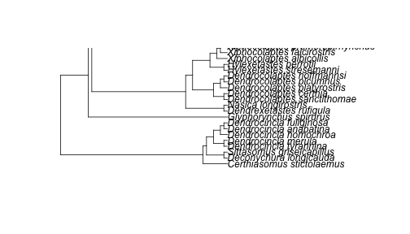

rOpenSci, Figshare and knitr.
========================================================

This is a tutorial of how you can create reproducible documents using [knitr]( http://yihui.name/knitr/) and pandoc, and seamlessly upload them to [figshare](http;//www.figshare.com) attaching a citable DOI to them. This document will walk you through the process of creating a document in knitr and uploading a compiled PDF to Figshare.  I make the following assumptions about your knowledge:

* You have set-up an account at [Figshare.com](http://www.figshare.com)

* You have installed [rfigshare](http://cran.r-project.org/web/packages/rfigshare/index.html), the [knitr](http://yihui.name/knitr/) package and are familiar with the concepts of knitr or sweave, as well as [pandoc](http://johnmacfarlane.net/pandoc/), for conversion to pdf (although this is only necessary if you want to convert your document to a pdf)

* You have successfully set-up the your credentials for rfigshare.  If not go to our [tutorial](http://github.com/ropensci/rfigshare/blob/master/inst/doc/tutorial.md) and make sure your credentials are properly set.


The goal of this document is to demonstrate how one could carry out a project using tools from [rOpenSci](http://www.ropensci.org/), knitr, and share the results on figshare in one continuous workflow.  To do this I'll be using a tutorial from one of our packages, [treebase](http://cran.r-project.org/web/packages/treebase/), which allows you to download trees from [TreebaseWEB](http://treebase.org/treebase-web/home.html;jsessionid=A258F89FBF584F44E0CDB740B8ECF3A8)


First I'll turn the cache on.

```r
opts_chunk$set(cache = TRUE, autodep = TRUE)
dep_auto()
```

Then you'll want to download some data, and maybe make a plot, and say some things about how great your plot is.

```r
library(treebase)
tree <- search_treebase("Derryberry", "author")[[1]]
# plotting only part of the tree because it's so large
plot.phylo(tree, y.lim = c(0, 20))
```

 


Once you've made all your plots, and said all you want to say it's time to convert your document, and then create a new article using `fs_new_article()`


```r
library(knitr)
library(rfigshare)
options(FigshareKey = "XXXXXXXX")
options(FigsharePrivateKey = "XXXXXXXX")
options(FigshareToken = "XXXXXXXX")
options(FigsharePrivateToken = "XXXXXXXX")

#knit document to pandoc markdown
knit("rfigtutorial.Rmd")
#convert to pdf
system("pandoc -S rfigtutorial.md -o rfigtutorial.pdf")

id <- fs_new_article(title="An rfigshare tutorial", 
                      description="How to create a document in knitr and 
                      upload it to figshare.com", 
                     
                      type="paper", 
                      authors=c("Edmund Hart"), 
                      tags=c("ecology", "openscience"), 
                      categories="Ecology", 
                      links="http://emhart.github.com", 
                      files="rfigtutorial.pdf",
                      visibility="draft")
```


The main advantage of this approach is that manuscripts can be worked on from within the R environment and then seemlessly uploaded to figshare. Also it's best practice to store your key values in your `.Rprofile` so I would reccomend file Be sure to run `fs_make_public(id)` when you're ready to make your article public.  


